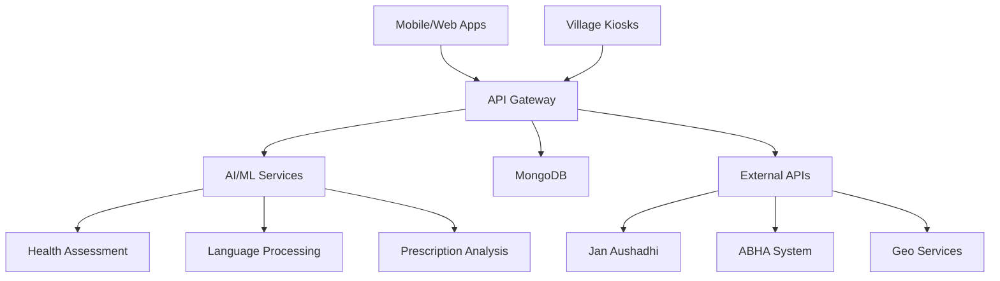

# वैदSeva 🏥 - Empowering Rural Healthcare Through Technology

[](https://github.com/aryan29gupta/ved-seva/stargazers)
[](https://github.com/aryan29gupta/ved-seva/network)
[](https://ved-seva.vercel.app/)

> **YOUR HEALTH OUR PRIORITY - Bridging the Healthcare Gap in Rural India with AI-Powered Telemedicine Solutions**

VedSeva is a comprehensive telemedicine platform designed specifically for rural India, addressing the critical healthcare accessibility challenges faced by over **900 million rural Indians**. Our solution combines AI-powered diagnostics, multilingual support, and offline-first functionality to deliver quality healthcare to the remotest villages.

**🔗 Quick Access Links:**
- 🌐 **Live Platform:** [ved-sevaa.vercel.app](https://ved-sevaa.vercel.app/) 
- 📹 **Demo Video:** [YouTube Presentation](https://youtu.be/ZLUWfYBtKfU?si=hI1Xguy76gxdV72F)
- 📊 **Source Code:** [GitHub Repository](https://github.com/aryan29gupta/ved-seva)
- 📚 **Research Paper:** [Complete Documentation](https://drive.google.com/file/d/10CSiUA1PUSc4GcmV33d7J2-uOxD-x075/view)

## 🌟 Features

- 🏥 **One-Tap Care Access** - Simple OTP/ABHA login with AI chatbot assistance
- 🏘️ **Village Kiosk Network** - Nurse-assisted consultations with digital health kits  
- 💊 **Smart Prescriptions** - Jan Aushadhi integration with real-time stock alerts
- 📊 **Health Insights** - AI-powered reports and NGO collaboration dashboard
- 💰 **Ultra-Affordable** - ₹10 consultations backed by government partnerships

## 🚀 Quick Start

```bash
# Clone the repository
git clone https://github.com/aryan29gupta/ved-seva.git
cd ved-seva

# Install backend dependencies
cd backend && npm install

# Install frontend dependencies  
cd ../frontend && npm install

# Install AI services dependencies
cd ../ai-services && pip install -r requirements.txt

# Set up environment variables
cp .env.example .env

# Start the application
npm run dev
```

Visit `http://localhost:3000` to see the app in action!

## 🛠️ Tech Stack

**Frontend:** React.js, React Native, Tailwind CSS, Redux Toolkit, Next.js

**Backend:** Node.js, Express.js, MongoDB, Socket.IO, WebRTC, Firebase

**AI/ML:** PyTorch, Transformers, Whisper, TensorFlow, Scikit-learn, NLTK

**Cloud:** Docker, Vercel, NIC Cloud, Firebase, Supabase

**APIs:** Jan Aushadhi, ABHA, Geo-location, Notification APIs

## 📊 Impact

| Metric | Before | After | Improvement |
|--------|--------|-------|-------------|
| Consultation Time | 4 hours | 30 minutes | 🔻 87.5% |
| Cost per Visit | ₹550 | ₹10 |
| Mortality Rate | Baseline | -30% | ✅ Preventable deaths |
| Doctor Access | Limited | 24/7 | ✅ Always available |

## 🎯 Problem We Solve

- **Doctor Shortage:** 1 doctor per 11,000 people in rural areas
- **High Travel Costs:** 4+ hours and ₹550+ for basic consultations  
- **Language Barriers:** Limited local language healthcare support
- **Poor Connectivity:** Inconsistent internet in remote villages
- **Low Health Literacy:** Lack of digital health awareness

## 💡 Our Solution

VedSeva creates a complete healthcare ecosystem:

```
🏥 AI Kiosks → 👨‍⚕️ Telemedicine → 💊 Smart Prescriptions → 🏘️ Community Care
```

### Key Innovations

- **Offline-First Design** - Works with limited internet connectivity
- **Multilingual AI** - Supports local languages with voice recognition
- **Government Integration** - ABHA, Jan Aushadhi, and NDHM compliance
- **Community-Centered** - NGO partnerships for sustainable impact

## 🏗️ Architecture



## 📈 Business Model

### Revenue Streams
- **Government Partnerships:** ₹369 crore telemedicine budget allocation
- **NGO Collaborations:** ₹21+ crore in healthcare funding
- **Corporate CSR:** Private sector social responsibility programs
- **Subscription Model:** Premium features for healthcare providers

### Investment Requirements
| Component | Cost Range | Purpose |
|-----------|------------|---------|
| Health Kiosk | ₹5,000 - ₹45,000 | Primary care station |
| Medical Devices | ₹3,150 - ₹5,000 | BP, Oxygen, Glucose monitors |
| **Total Setup** | **₹67,400 - ₹1,09,800** | **Complete village solution** |

## 🌍 Scalability Roadmap

**Phase 1:** Punjab & Nabha (Pilot) - 100 kiosks
**Phase 2:** Medically Underserved Areas - 1,000 kiosks  
**Phase 3:** Pan-India Rural Healthcare - 10,000+ kiosks

## 🎯 Demo & Links

- 🌐 **Live Demo:** [https://ved-sevaa.vercel.app/](https://ved-sevaa.vercel.app/) - वैदSeva: YOUR HEALTH OUR PRIORITY
- 📹 **Demo Video:** [Watch Full Presentation](https://youtu.be/ZLUWfYBtKfU?si=hI1Xguy76gxdV72F)
- 📊 **GitHub Repository:** [https://github.com/aryan29gupta/ved-seva](https://github.com/aryan29gupta/ved-seva)
- 🔍 **Research Documentation:** [Complete Research Paper](https://drive.google.com/file/d/10CSiUA1PUSc4GcmV33d7J2-uOxD-x075/view)

## 🔐 Security & Compliance

- ✅ **ABHA Integration** - Secure health ID management
- ✅ **NDHM Compliance** - National Digital Health Mission standards
- ✅ **Data Encryption** - End-to-end encrypted patient data
- ✅ **Privacy Protection** - GDPR-compliant data handling
- ✅ **Multi-factor Auth** - Secure access control

## 🧪 Testing

### Test Credentials
```
Doctor: Mohit@123 / 1234567890
Patient: Suresh@123 / 1234567890  
Nurse: Priya@123 / 1234567890
NGO: Seva@123 / 1234567890
```

### API Testing
```bash
# Health assessment endpoint
curl -X POST http://localhost:5000/api/ai/assess \
  -H "Content-Type: application/json" \
  -d '{"symptoms": "fever, cough", "language": "hi"}'

# Consultation booking
curl -X POST http://localhost:5000/api/consultations/book \
  -H "Authorization: Bearer <token>" \
  -d '{"symptoms": ["fever"], "urgency": "medium"}'
```

## 🤝 Contributing

We welcome contributions! Please see our [Contributing Guide](CONTRIBUTING.md) for details.

1. Fork the repository
2. Create a feature branch (`git checkout -b feature/amazing-feature`)
3. Commit your changes (`git commit -m 'Add some amazing feature'`)
4. Push to the branch (`git push origin feature/amazing-feature`)
5. Open a Pull Request

## 📊 Comparison with Existing Solutions

| Feature | VedSeva | Practo | Tata 1mg | Aarogya Setu |
|---------|---------|--------|----------|--------------|
| Rural Focus | ✅ | ❌ | ❌ | Partial |
| Local Language | ✅ | ❌ | ❌ | ✅ |
| Offline Mode | ✅ | ❌ | ❌ | ❌ |
| ₹10 Consultations | ✅ | ❌ | ❌ | ✅ |
| Kiosk Integration | ✅ | ❌ | ❌ | ❌ |
| NGO Partnership | ✅ | ❌ | ❌ | ✅ |

## 🏆 Recognition & Impact

- 🏅 **Smart India Hackathon 2025** - Finalist
- 📊 **Target Impact:** 900M+ rural Indians
- 🎯 **Pilot Program:** Punjab Government Partnership
- 🌟 **Expected Reach:** 10,000+ villages by 2027

## 📞 Contact

- **Email:** team.vedseva@gmail.com
- **GitHub:** [@aryan29gupta](https://github.com/aryan29gupta)  
- **LinkedIn:** [VedSeva Team](https://linkedin.com/company/vedseva)
- **Website:** [https://ved-sevaa.vercel.app/](https://ved-sevaa.vercel.app/)

## 📄 License

This project is licensed under the MIT License - see the [LICENSE](LICENSE) file for details.

## 🙏 Acknowledgments

- Ministry of Health & Family Welfare, Government of India
- National Health Mission (NHM)
- Jan Aushadhi Scheme  
- Smart India Hackathon 2025 organizing committee
- All NGO partners and rural healthcare workers

---

<div align="center">

**⭐ Star this repo if you find it helpful!**

**VedSeva - Transforming Rural Healthcare, One Village at a Time** 🌾🏥

*Made with ❤️ for Rural India*

</div>
